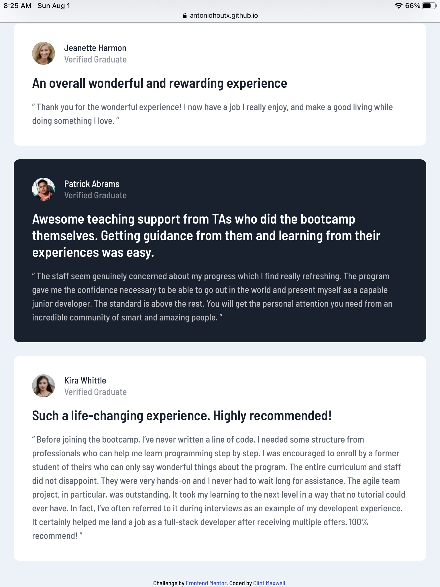

# Frontend Mentor - Testimonials grid section solution

This is a solution to the [Testimonials grid section challenge on Frontend Mentor](https://www.frontendmentor.io/challenges/testimonials-grid-section-Nnw6J7Un7). Frontend Mentor challenges help you improve your coding skills by building realistic projects. 

## Table of contents

- [Overview](#overview)
  - [The challenge](#the-challenge)
  - [Screenshot](#screenshot)
  - [Links](#links)
- [My process](#my-process)
  - [Built with](#built-with)
  - [What I learned](#what-i-learned)
  - [Continued development](#continued-development)
  - [Useful resources](#useful-resources)
- [Author](#author)
- [Acknowledgments](#acknowledgments)


## Overview

### The challenge

Users should be able to:

- View the optimal layout for the site depending on their device's screen size

### Screenshot

Desktop Version


Mobile Version (Top, Middle, and Bottom)


Tablet Version (Top & Bottom)




### Links

- Solution URL: [Add solution URL here](https://your-solution-url.com)
- Live Site URL: [https://antoniohoutx.github.io/testimonials-grid-section-main/](https://antoniohoutx.github.io/testimonials-grid-section-main/)

## My process

### Built with

- Semantic HTML5 markup
- CSS custom properties
- Flexbox
- CSS Grid
- Mobile-first workflow
### What I learned

In this project I learned to combine CSS Grid with CSS Flexbox.  Some of the sample code that demonstrates this is:

```css
.name {
  display: flex;
  flex-direction: column;
  margin-left: 1rem;
}
```
```css
.container {
    max-width: 90rem;
    display: grid;
    grid-template-columns: 1fr 1fr 1fr 1fr;
    grid-template-rows: 1fr 1fr;
  }
```
### Continued development

Some techniques that I would like to refine and perfect for future projects are reconciling the various desktop display pixel widths in existence and trying to find a "happy medium" that allows a website to render properly on the greatest number of different screen widths possible.  In this project, as shown above, I did use a "max-width: 90rem" to properly render the page on my 24" iMac, even though it is my understanding that it is poor CSS practice.  

### Useful resources

- [W3 Schools](https://www.w3schools.com/) - Once again, straight from the horse's mouth, the ultimate reference to HTML & CSS from the people of the W3C proved an invaluable resource.
## Author

- Frontend Mentor - [@AntonioHouTX](https://www.frontendmentor.io/profile/AntonioHouTX)

## Acknowledgments

Once again, special thanks to [Drull](https://github.com/drull1000) for his time and patience in assisting me with this project.  


